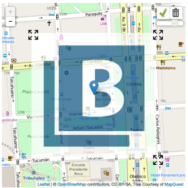

# Leaflet.AffineImage


This is an overlay for leaflet[1] that lets you display an image on top of
the map, transform it using three anchors, and customise the opacity of the image using the toolbox provided.

This code is inspired & portions taken from:  
    - [John P. Kiffmeyer](https://github.com/thatjpk/LeafletAffineImageOverlay)  
	- [Stanislav Sumbera](https://gist.github.com/Sumbera/11114288)

This mainly takes the ideas of [Stanislav Sumbera](https://gist.github.com/Sumbera/11114288) in terms of sekeleton and implementing an L.Class and uses the main methods of [John P. Kiffmeyer](https://github.com/thatjpk/LeafletAffineImageOverlay) to create resizers (anchors) and render the image.  

[1] http://leaflet.cloudmade.com/



```js
var image = new Image();

image.onload = function() {

    L.affineImage().params({image:image,boundingScale:0.5}).addTo(map);
    
    //Adding marker
    L.marker([-34.6,-58.383],{draggable: true}).addTo(map);

};

image.src = "./img/buildingLayer.png";
```

Look at index.html for a usage example.

### LEGAL

<federico.alconada@icloud.com> wrote this file. As long as you retain this notice you
can do whatever you want with this stuff.